Task 2: Working with the Backlog

1.  Navigate to the backlog by clicking **Backlog** under the
    **Work** section.

<!-- -->

1.  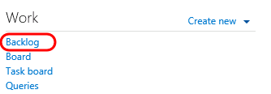

<!-- -->

1.  Figure

<!-- -->

1.  Navigating to the backlog

<!-- -->

1.  

<!-- -->

1.  The product backlog helps define the work that needs to be done.
    Once you have a backlog, you can use it to help manage when that
    work gets done, as well as associate items on the backlog with
    check-ins, acceptance tests, or other criteria.

<!-- -->

1.  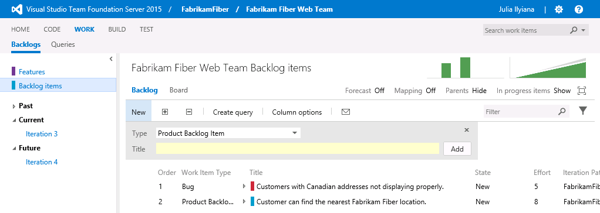

<!-- -->

1.  Figure

<!-- -->

1.  Product backlog view

<!-- -->

1.  

<!-- -->

1.  **Note:** The Current iteration shown in the tree on the left side
    of this screen is Iteration 3. Team Foundation Server uses the
    current date and time to determine the current iteration. The
    virtual machine you are using has been set to use a date of July 9,
    2013 for purposes of this lab.

<!-- -->

1.  

<!-- -->

1.  Imagine that the VP of Fabrikam Fiber has requested that a new user
    story be implemented for the customer-facing service portal. This
    new user story will enable customers to see weather-related
    service outages. This user story is being designated as
    high-priority because many customers requested it and customer
    service indicated that it would greatly reduce phone support
    during outages.

2.  Select the last row of the product backlog and then create a new
    **Product Backlog Item** with the title “***Customer should see
    weather-related outages on portal.”***

<!-- -->

1.  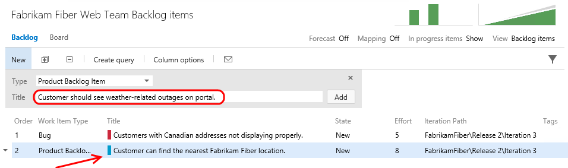

<!-- -->

1.  Figure

<!-- -->

1.  Adding a new user story to the product backlog

<!-- -->

1.  

<!-- -->

1.  **Note:** New work items are generally inserted above the
    selected location. The exception is that if you select the last work
    item, the insertion will be after the selected location.

<!-- -->

1.  

<!-- -->

1.  Click **Add** to add the new user story to the backlog.

<!-- -->

1.  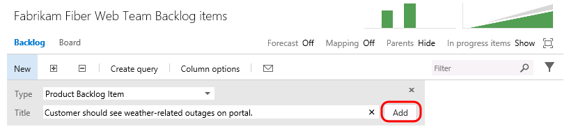

<!-- -->

1.  Figure

<!-- -->

1.  Adding a new user story to the product backlog

<!-- -->

1.  

<!-- -->

1.  Work items on the product backlog are ordered based on priority with
    high priority items at the top. Our new work item has a high
    priority so move it to the top of the list by dragging and dropping
    it into place.

<!-- -->

1.  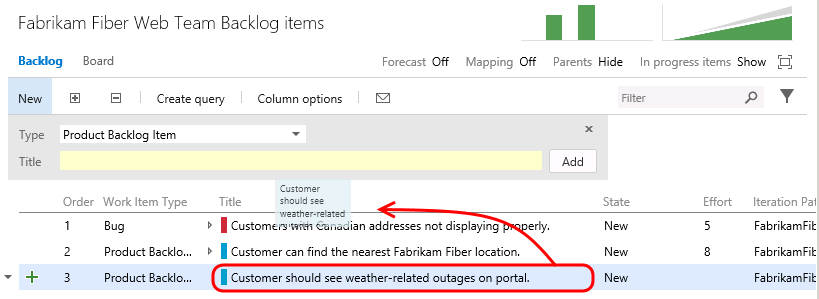

<!-- -->

1.  Figure

<!-- -->

1.  Increasing the priority of the new user story

<!-- -->

1.  

<!-- -->

1.  Let’s edit the new user story to assign it to the appropriate
    product owner and record an initial estimate of expected effort.
    **Double-click** the new user story.

<!-- -->

1.  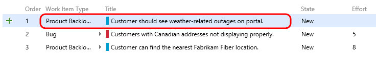

<!-- -->

1.  Figure

<!-- -->

1.  Editing the new user story

<!-- -->

1.  

<!-- -->

1.  Assign the new item to **Brian Keller** (the product owner for the
    Fabrikam Fiber Team), set the state to **Approved**, and set an
    initial effort of ‘**8**’. Click **Save and Close**.

    

<!-- -->

1.  Figure

<!-- -->

1.  Assigning the new user story and estimating effort

<!-- -->

1.  

<!-- -->

1.  **Note:** Each team may choose to define the **Effort** value as
    they see fit, using a unit of story points, hours, days, or number
    of sodas required. The point here is that this measure is a relative
    value with respect to other work items. Work will be broken down
    into hours later.

    **Note:** A popular planning approach that helps to eliminate group
    think and considers input from all team members is known as
    planning poker. You can read more about it at
    <http://en.wikipedia.org/wiki/Planning_poker>.

<!-- -->

1.  

<!-- -->

1.  Assign the new user story to the current iteration, ***Iteration
    3***, by dragging and dropping it as shown below.

<!-- -->

1.  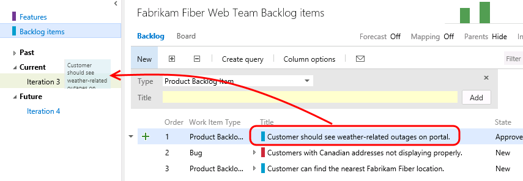

<!-- -->

1.  Figure

<!-- -->

1.  Assigning the new user story to the current iteration

<!-- -->

1.  

<!-- -->

1.  **Note:** If you are a Scrum purist, you are probably cringing at
    the fact that we just added new work to a mid-flight iteration.
    While this is something you might never do in the real world, this
    is a shortcut taken for purposes of this lab in order to simplify
    the workflow and still show you all of the aspects of the project
    management interface. Well, that and the VP told you to.

<!-- -->

1.  Look at the **Iteration Path** for the new user story to make sure
    that it is assigned to *Iteration 3* as expected. This user story
    will remain on the product backlog until the work has
    been completed.

<!-- -->

1.  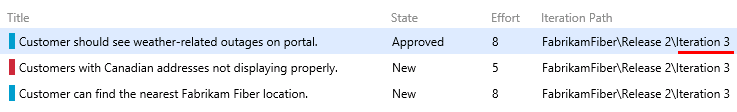

<!-- -->

1.  Figure

<!-- -->

1.  Assigning the new user story to the current iteration

<!-- -->

1.  

<!-- -->

1.  If you made a mistake when adding a work item, or if the work item
    simply shouldn’t be part of the backlog for any reason, you can drag
    it to the **Recycle Bin**. Drag the item you just created onto the
    **Recycle Bin**. Then click the **Recycle Bin** to view
    its contents.

    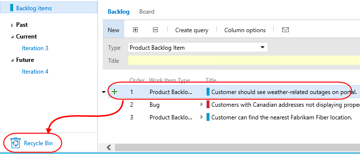

2.  Right now it only contains the item you just deleted. Fortunately,
    you can right-click the item and select **Restore** to put it back
    where it belongs. Confirm the restoration when asked.

    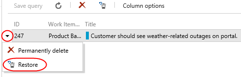

3.  It’s now time to return to the backlog. However, since you’re in the
    **Recycle Bin**, there’s no direct path. Fortunately, TFS now
    supports a variety of **keyboard shortcuts** that make rapid
    navigation as easy as possible. Press the “**?”** key (probably
    **Shift+/**) on your keyboard to view the available options.

    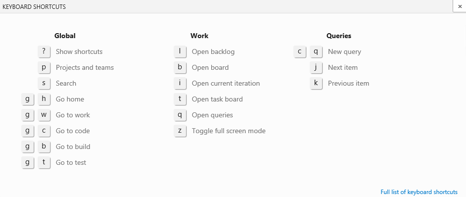

4.  The shortcut to the backlog is the **l** (lowercase “L”) key. Press
    it now to go there.

5.  The product backlog view also provides a velocity chart that shows
    the amount of work that the team has undertaken in each sprint, with
    the current sprint breaking that down further to differentiate
    between work in progress and work completed. Click the mini chart in
    the upper-right corner to load the larger view.

<!-- -->

1.  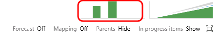

<!-- -->

1.  Figure

<!-- -->

1.  Location of velocity chart

<!-- -->

1.  

<!-- -->

1.  During *Iteration 1*, the team completed 35 story points worth
    of effort. *Iteration 2* was more productive with 49 story
    points completed. The current iteration, represented by *Iteration
    3*, shows that we do not currently have any work items in the
    Committed state. Remember that these story points are a relative
    measure of effort that was agreed upon by the team.

<!-- -->

1.  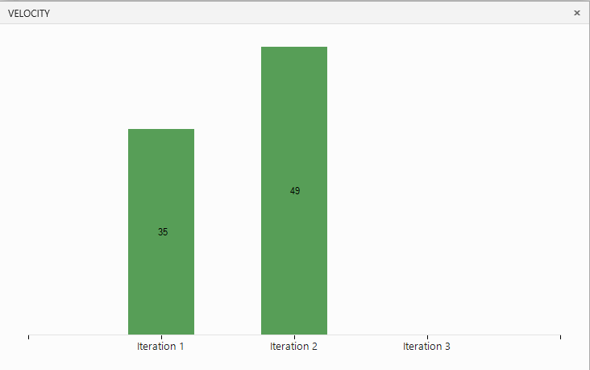

<!-- -->

1.  Figure

<!-- -->

1.  Velocity chart showing progress towards completing user stories

<!-- -->

1.  

<!-- -->

1.  Press the **Escape** key to close the velocity chart.

2.  The product backlog view also groups the past, current, and future
    iterations by their assigned dates. Click **Iteration 3** so that we
    can break down work and assign it to the appropriate team members.

<!-- -->

1.  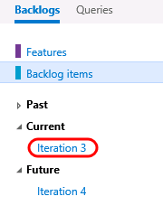

<!-- -->

1.  Figure

<!-- -->

1.  Navigating to the current backlog

<!-- -->

1.  

<!-- -->

1.  Before we break down the new user story, let’s take a quick tour of
    this iteration backlog view. To start with, it shows all user
    stories and associated tasks that are assigned to the selected
    iteration, regardless of state.

<!-- -->

1.  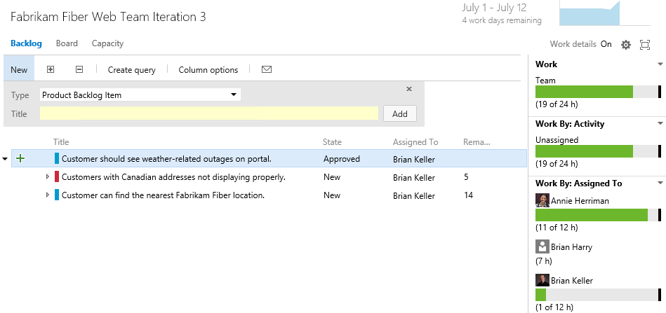

<!-- -->

1.  Figure

<!-- -->

1.  Current iteration backlog view

<!-- -->

1.  

<!-- -->

1.  At a glance, you can see that the current iteration runs from July 1
    to 12, with four work days remaining. Just to the right of the
    current iteration date range, there is a small graph showing the
    burn down of the remaining work.

<!-- -->

1.  

    Figure

<!-- -->

1.  Burn down graph

<!-- -->

1.  

<!-- -->

1.  Click the burn down graph to view it. The graph shows remaining work
    over the course of the iteration. It also provides insight for the
    **Available Capacity** that can be applied to the work (total work
    hours remaining across resources).

<!-- -->

1.  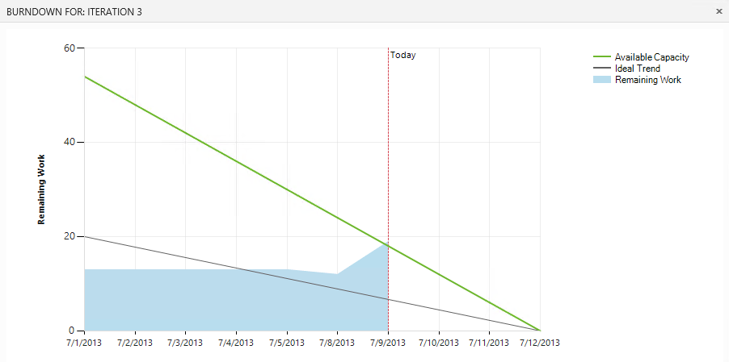

<!-- -->

1.  Figure

<!-- -->

1.  Enlarged burn down graph

<!-- -->

1.  

<!-- -->

1.  Press the **Escape** key to close the burn down graph.

2. 