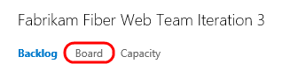
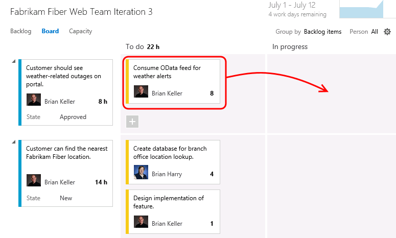
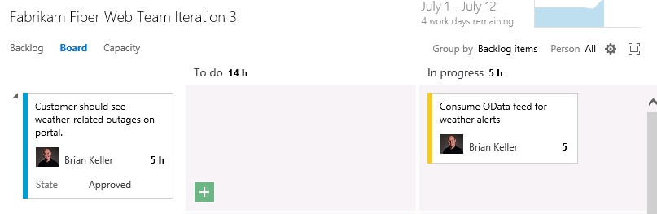
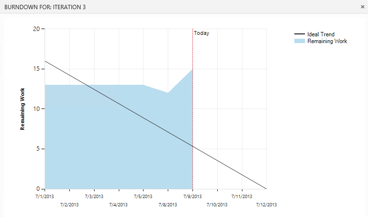
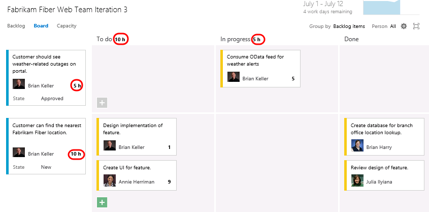
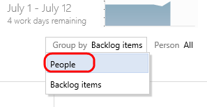
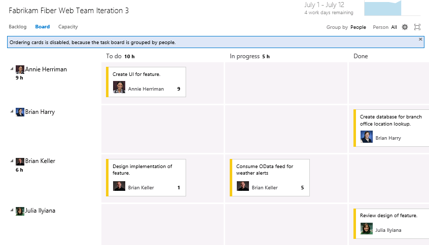
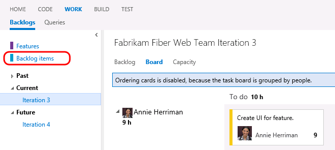

####Task 4: Working with the Task Board

1.  Now that we have finished breaking down the work and assigning it to
    team members, let’s take a look at the task board that will be used
    in the next stand-up team meeting to report and record progress.
    Select the **Board** tab from Iteration 3.

1.  

1.  Figure

1.  Task board link

1.  

1.  By default, the task board shows all tasks for the current iteration
    grouped by product backlog item and by the current state. Drag and
    drop the “**Consume OData feed for weather alerts**” task to the
    **In Progress** column.

1.  

1.  Figure

1.  Drag and drop tasks on the task board to move them between states

1.  

1.  **Note:** The task board is touch enabled as well. This will not
    work within this virtual machine, but you might want to put in your
    request now for that nice wall-mounted touch-screen monitor you have
    been desiring for your team.

    **Note:** Team Foundation Server 2015 has introduced numerous
    enhancements to the cards shown for tasks and Kanban views including
    styling, use of avatars, and even responsive layout based on
    browser size.

1.  **Single-click** the ‘**8**’ value shown on the “**Consume OData
    feed for weather alerts**” task and change the Remaining Work to
    **5** to simulate Brian working on the task during the day.

1.  

1.  Figure

1.  Updating remaining work for a task

1.  

1.  The new high-priority task is now in progress with an estimated 5
    hours of work left to go.

1.  

1.  Figure

1.  Task board

1.  

1.  Drag and drop the task titled “**Create database for branch office
    location lookup**” to the **Done** column to record that work
    as completed. Note that the remaining work is automatically reduced
    to **0**.

1.  

1.  Figure

1.  Completing a task with the task board

1.  

1.  Notice that the burn down chart in the top-right corner is
    automatically updated after you made changes on the task board.
    Click the burn down chart and note that there is about 15 hours of
    effort left in order to complete the work for the iteration.

1.  

1.  Figure

1.  Burn down chart

1.  

1.  Close the burn down chart.

2.  Note that each row representing a work item shows a rollup of hours
    remaining, which is a sum of remaining work for all child tasks. In
    addition to that each column representing a status has a rollup of
    remaining work giving you a good idea of how much work the team is
    actively working on right now.

1.  

1.  Figure

1.  Task board showing rollup of hours

1.  

1.  The task board also groups by team members. Select the **People**
    grouping option in the top-right of the task board view.

1.  

1.  Figure

1.  Group tasks by people

1.  

1.  This view makes it easy to see what team members are currently
    working on and how much effort remains for each for the remainder of
    the current iteration.

1.  

1.  Figure

1.  Grouping tasks by people

1.  

1.  Click **Backlog Items** to return to the backlog portfolio for
    the team.

1.  

1.  Figure Backlog view

