1.  In this exercise, you will learn how to use Team Foundation Server
    2015 to manage your product backlog, create work items, break work
    items into tasks, assign tasks to team members, and track progress
    using the task board. This overview will demonstrate the basic
    project management tools that small- to medium-sized development
    teams can utilize for product development.

1.  **Note:** The team project used in this lab uses a Scrum process
    template, but the core features demonstrated apply to all
    process templates.

1.  

#### Task 1: Team Foundation Server Web Portal

1.  Log in as **Julia Ilyiana** (VSALM\\Julia). All user passwords are
    **P2ssw0rd**.

1.  **Note:** In order to fully demonstrate the ALM features in this
    lab, we will first set the virtual machine to a specific date that
    lines up with a pre-configured, in-flight iteration. This lab needs
    to be walked through using the original virtual machine state
    (without any modifications made to source or work items), otherwise
    you will see errors.

1.  **Right-click** the **ConfigureALMDemo.bat** file on the Desktop and
    then select “**Run as administrator**”. This will set the date and
    time in the virtual machine to be a specific date that lines up with
    the demonstration data.

2.  Launch **Internet Explorer** from the taskbar and click **TFS FF
    Portal** from the favorites bar at the top.

1.  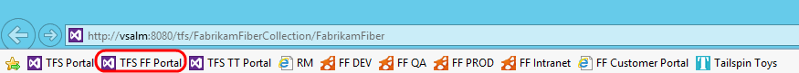

1.  Figure

1.  Launching the web portal

1.  

1.  **Note:** There is also a **Web Portal** link in the Team Explorer
    window within Visual Studio.

    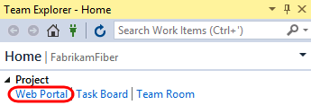

1.  

1.  Select the team drop-down box in the top-right corner of the portal
    and select the **Browse All** option.

1.  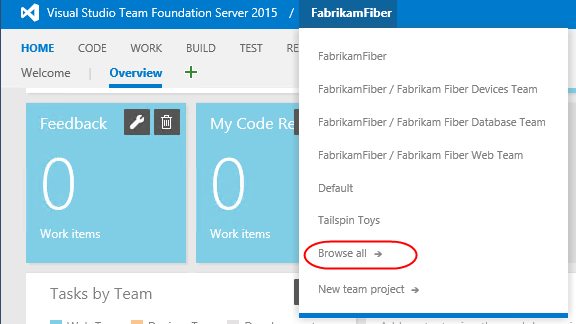

1.  Figure

1.  Browsing teams

1.  **Note:** There is also an option to create a **New team project**
    directly from the web site. In addition, users with the appropriate
    permissions can delete projects as well.

1.  

1.  This view shows that the Fabrikam Fiber collection has one project
    in it named **FabrikamFiber**. This project contains a few different
    teams, with the **Fabrikam Fiber Leadership Team** being set as the
    default team for the project. We will take a closer look at teams in
    a later exercise.

1.  **Note:** This lab refers to this default team as both the
    leadership team and the management team. They both refer to the
    same team.

1.  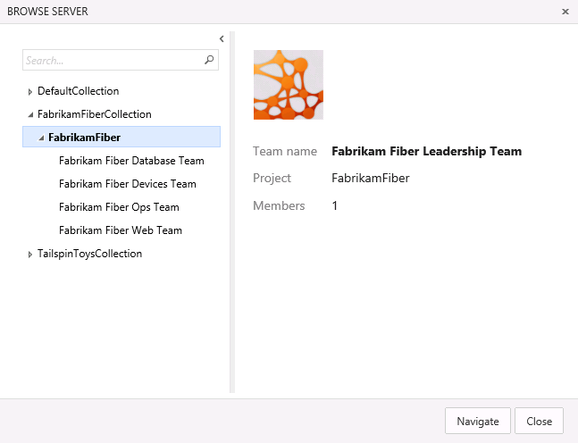

1.  Figure

1.  Browsing teams

1.  

1.  Select the **Fabrikam Fiber Web Team** and then click **Navigate**.

1.  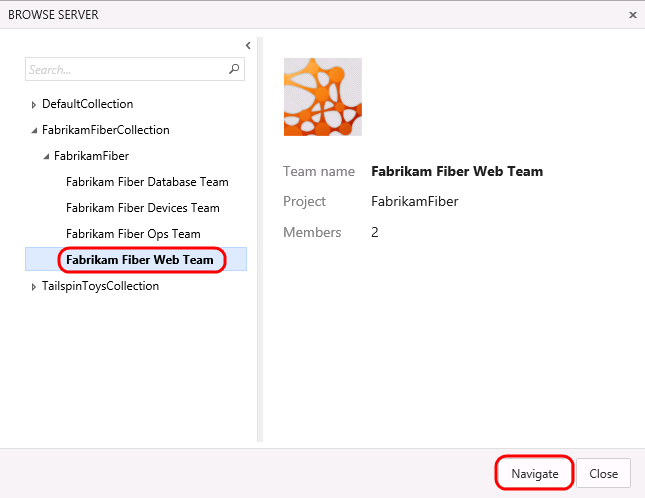

1.  Figure

1.  Navigating to a different team

1.  The **Home** view for the Fabrikam Fiber Web team provides a
    high-level overview of the current iteration (Sprint 3) including
    team workload versus capacity, burndown of tasks over time, and team
    favorites, which can include a configurable assortment of work item
    queries, build definitions, and version control paths. In addition,
    there are links to quickly create new work items and bugs, load the
    backlog, task board, initiate requests for feedback and so on.

1.  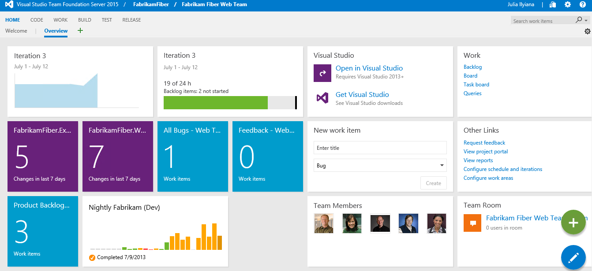

    Figure

1.  Fabrikam Fiber team home view

1.  

1.  **Note:** Team favorites can be added or removed from within the
    web portal. For example, navigate to the Build tab to assign build
    definitions as a team favorite. In addition, team favorite work item
    queries can be modified from within Visual Studio.

    Each team can have different team favorites listed, different work
    capacity, and even different work items. The determining factor of
    where a work item will show up is governed by the **Area** field.

1.  As you can see under the **Team Members** section, there are several
    members listed in this team. Teams are a concept that were
    originally introduced in Team Foundation Server 2012 to make it
    easier to manage, assign, and track work.

2.  

 

#### Task 3: Team Capacity Planning

1.  Locate the overall **Work** bar that shows how close to capacity we
    are for the current iteration based on the total of the Remaining
    Work for the tasks in this iteration and based on the total capacity
    for the team. It looks like we are okay now, but we still haven’t
    broken the new user story into tasks for the team yet.

1.  

1.  Figure

1.  Overall remaining work with respect to team capacity

1.  

1.  Select the **Capacity** tab to review the team capacity details.

1.  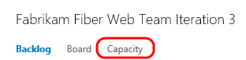

1.  Figure

1.  Location of Capacity link

1.  

1.  The capacity view allows us to specify the number of hours per day
    that each team member will be working on this project, days off per
    team member, and overall team days off. These capacity settings
    apply to the current iteration. You can optionally use the activity
    column to describe the disciplines that each team member
    specializes in. When tasks are broken down by activity as well, it
    can provide another view across your team’s capacity to determine
    if, for example, you have enough people working on documentation to
    meet the demands for this iteration. For now, leave the capacity
    settings unmodified.

1.  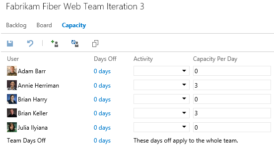

1.  Figure

1.  Team capacity settings

1.  

1.  Return to the **Backlog** view for the current iteration.

1.  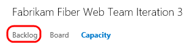

1.  Figure

1.  Location of Contents tab

1.  

1.  Let’s say that the decision is made to proceed with committing to
    the new work item. Return to the **Iteration 3** backlog view. Click
    the button with the ‘**+**’ symbol in it to the left of the new user
    story to add a new task. This will become a child task of the user
    story and will be used to help describe the implementation details
    required to complete this user story.

1.  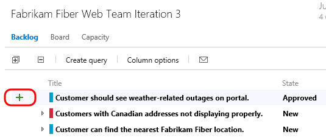

1.  Figure

1.  Location of the button used to create new tasks

1.  

1.  For the new task, enter “**Consume OData feed for weather alerts**”
    for the Title, assign it to **Brian Keller**, and set the Remaining
    Work to **8** hours. Click **Save and Close**.

1.  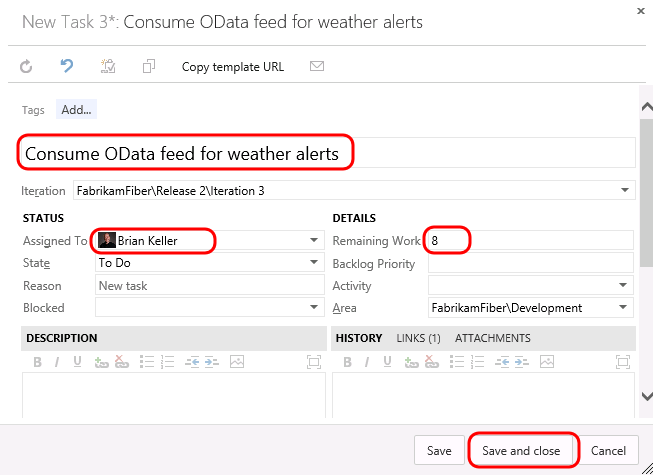

1.  Figure

1.  Creating a new task

1.  

1.  Note that the new task was added as a child of the user story and
    that the overall team work bar has turned red indicating that we
    have too much work assigned based on capacity.

1.  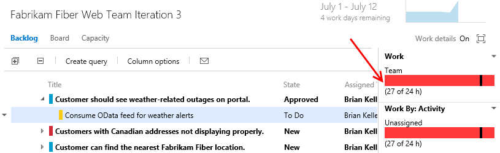

1.  Figure

1.  Insert Caption

1.  

1.  It looks like the bug has not been worked on yet, so this may be a
    good candidate to reschedule for a future iteration so that the team
    can get back on track given their additional workload. Drag and drop
    the bug onto **Iteration 4** on the left-hand side of the window.

1.  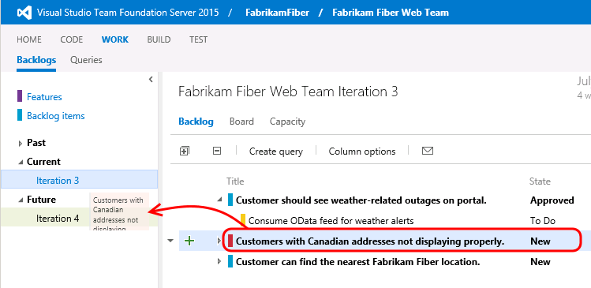

1.  Figure

1.  Using drag and drop to re-assign work to different iterations

1.  

1.  Take another look at the overall **Work** bar once again to make
    sure it is now green. This means that we are within the current
    team capacity. Just don’t tell the VP, or he might find another
    high-priority request for us to work on!

1.  

1.  Figure

1.  Remaining work for current iteration is within team capacity

1.  

1.  

####Task 4: Working with the Task Board

1.  Now that we have finished breaking down the work and assigning it to
    team members, let’s take a look at the task board that will be used
    in the next stand-up team meeting to report and record progress.
    Select the **Board** tab from Iteration 3.

1.  

1.  Figure

1.  Task board link

1.  

1.  By default, the task board shows all tasks for the current iteration
    grouped by product backlog item and by the current state. Drag and
    drop the “**Consume OData feed for weather alerts**” task to the
    **In Progress** column.

1.  

1.  Figure

1.  Drag and drop tasks on the task board to move them between states

1.  

1.  **Note:** The task board is touch enabled as well. This will not
    work within this virtual machine, but you might want to put in your
    request now for that nice wall-mounted touch-screen monitor you have
    been desiring for your team.

    **Note:** Team Foundation Server 2015 has introduced numerous
    enhancements to the cards shown for tasks and Kanban views including
    styling, use of avatars, and even responsive layout based on
    browser size.

1.  **Single-click** the ‘**8**’ value shown on the “**Consume OData
    feed for weather alerts**” task and change the Remaining Work to
    **5** to simulate Brian working on the task during the day.

1.  

1.  Figure

1.  Updating remaining work for a task

1.  

1.  The new high-priority task is now in progress with an estimated 5
    hours of work left to go.

1.  

1.  Figure

1.  Task board

1.  

1.  Drag and drop the task titled “**Create database for branch office
    location lookup**” to the **Done** column to record that work
    as completed. Note that the remaining work is automatically reduced
    to **0**.

1.  

1.  Figure

1.  Completing a task with the task board

1.  

1.  Notice that the burn down chart in the top-right corner is
    automatically updated after you made changes on the task board.
    Click the burn down chart and note that there is about 15 hours of
    effort left in order to complete the work for the iteration.

1.  

1.  Figure

1.  Burn down chart

1.  

1.  Close the burn down chart.

2.  Note that each row representing a work item shows a rollup of hours
    remaining, which is a sum of remaining work for all child tasks. In
    addition to that each column representing a status has a rollup of
    remaining work giving you a good idea of how much work the team is
    actively working on right now.

1.  

1.  Figure

1.  Task board showing rollup of hours

1.  

1.  The task board also groups by team members. Select the **People**
    grouping option in the top-right of the task board view.

1.  

1.  Figure

1.  Group tasks by people

1.  

1.  This view makes it easy to see what team members are currently
    working on and how much effort remains for each for the remainder of
    the current iteration.

1.  

1.  Figure

1.  Grouping tasks by people

1.  

1.  Click **Backlog Items** to return to the backlog portfolio for
    the team.

1.  

1.  Figure Backlog view

Exercise 2: Agile Portfolio Management
------------------------------------------------------------------------------------------------------------------------------------

1.  In this exercise, you will learn about some of the agile portfolio
    management capabilities provided by Team Foundation Server. These
    capabilities allow larger organizations to understand the scope of
    work across several teams and see how that work rolls up into
    broader initiatives. In this exercise, you will explore how multiple
    teams at Fabrikam Fiber can collaborate together to work
    on features.

#### Task 1: Configuring Team Hierarchy and Area Paths

1.  Let’s start out by taking a look at the Fabrikam Fiber project from
    the top-down, in a manner that would typically be associated with a
    management role.

2.  Click the gear icon in the top-right corner of the web portal. This
    opens the administration pages in a new tab.

1.  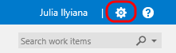

1.  Figure

1.  Loading administration site

1.  

1.  Navigate to the **FabrikamFiber** project node.

1.  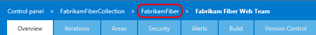

1.  Figure

1.  Navigate to project node

1.  

1.  The FabrikamFiber project has five teams, with the **Fabrikam Fiber
    Leadership Team** assigned as the project default.

1.  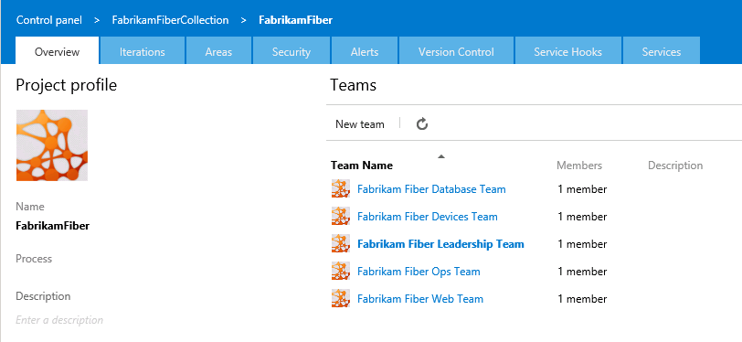

1.  Figure

1.  Fabrikam Fiber teams

1.  

1.  Select the **Areas** tab.

1.  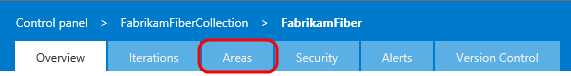

1.  Figure

1.  Areas tab

1.  

1.  The management team currently owns the **Development** area and
    all sub-areas. This gives them visibility into the backlog of all
    teams, even for work items that are not mapped to features.
    Optionally, the management team could also choose to not include
    sub-areas, thereby removing work items from their product backlog
    view as soon as they are assigned to one of the teams.

1.  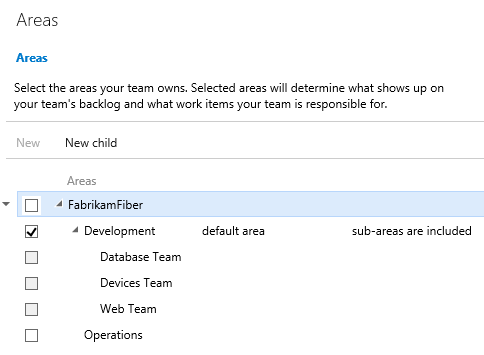

1.  Figure

1.  Area configuration for management team

1.  

1.  Select the **Overview** tab.

1.  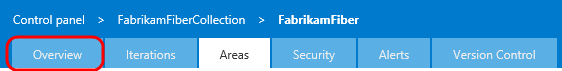

1.  Figure

1.  Overview tab

1.  

1.  Click **Fabrikam Fiber Database Team**.

1.  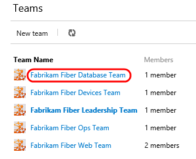

1.  Figure

1.  Fabrikam Fiber Database Team link

1.  

1.  Select the **Areas** tab.

1.  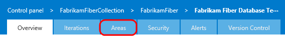

1.  Figure

1.  Areas tab

1.  

1.  The Database team is currently configured to see work items from
    just the root Development area and the Database Team sub-area. This
    allows them to see backlog items created by the management team and
    ones specifically assigned to their team. With this kind of
    structure, each team can work independently on its own backlog,
    defined by its area path, unrelated to the other team’s work.

1.  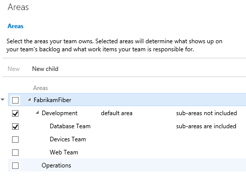

1.  Figure

1.  Area configuration for Database team

1.  

1.  Close the administration tab in Internet Explorer to return to the
    web portal browser tab.

2.  From the top navigation, select **FabrikamFiber | Browse all**.

    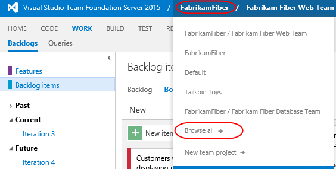

3.  Select the **Fabrikam Fiber Leadership Team** and click
    **Navigate**.

1.  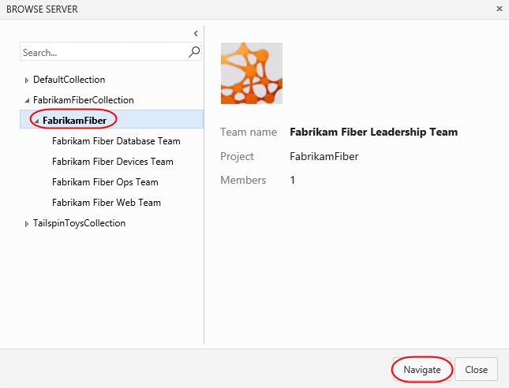

1.  Figure

1.  Navigating to management team

1.  

1.  

#### Task 2: Portfolio Management

1.  Switch to the **Backlog** view if necessary.

1.  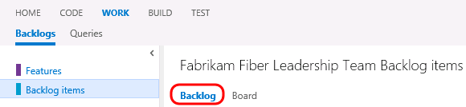

1.  Figure

1.  Returning to Backlog view

1.  

1.  The leadership team can see backlog items across all teams,
    including status and scheduled iteration.

1.  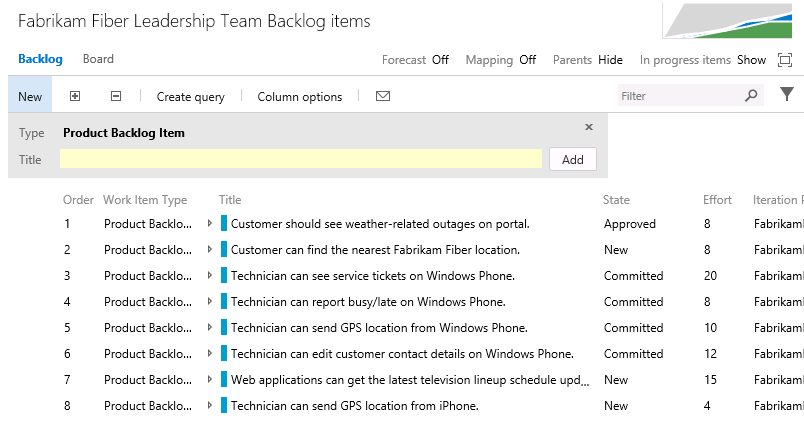

1.  Figure

1.  Backlog items for leadership team

1.  

1.  The backlog view also includes the ability to toggle the display of
    in-progress work items. Toggle the “**In progress items**” link in
    the top-right corner of the backlog view and note that the Committed
    work items are no longer displayed. Toggle the link once again to
    view in-progress items before moving on.

1.  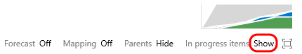

1.  Figure

1.  Location of link to show/hide in-progress items

1.  

1.  Note that the in-progress work items are no longer displayed. Toggle
    the link once again to view in-progress items as before.

1.  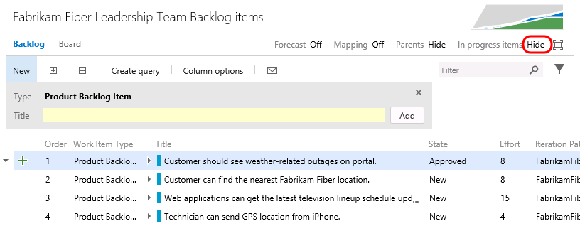

1.  Figure

1.  Location of link to show/hide in-progress items

1.  

1.  Click **Features** to view the feature backlog.

1.  

1.  Figure

1.  Viewing features backlog

1.  

1.  This view shows the top-level features for the project. It is
    possible to drill down into backlog items and even individual tasks
    if desired. Click the **Expand** button to expand one level.

1.  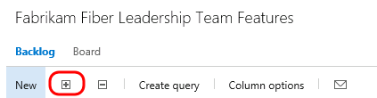

1.  Figure

1.  Expand button

1.  

1.  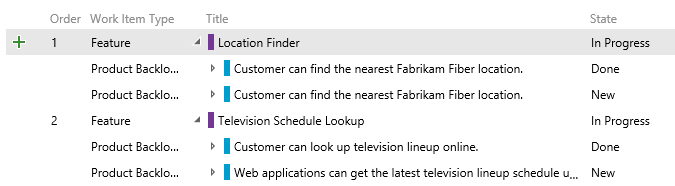

1.  Figure

1.  Expanded view

1.  

1.  Click the **Expand** button once again to drill down into tasks.

1.  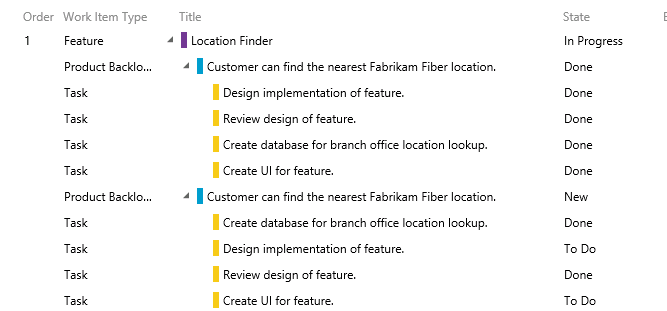

1.  Figure

1.  Expanded view

1.  

1.  It is also possible to re-parent work items using drag-and-drop
    operations in the portfolio backlog view. Try this out by dragging
    and dropping one of the Product Backlog Items from one feature
    to another.

1.  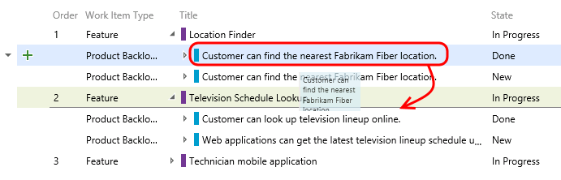

1.  Figure

1.  Re-parent work items using drag and drop

1.  

1.  Note that this moved the Product Backlog Item as well as all of the
    child tasks. Drag the Product Backlog Item back to its
    original feature.

2.  The child work items are always shown for the leadership team,
    regardless of which team they are assigned to. To see this more
    clearly, let’s add the **Area Path** column to the view.

3.  Click **Column Options**.

1.  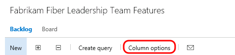

1.  Figure

1.  Column Options button

1.  

1.  **Double-click** **Area Path** from the available columns and then
    click **OK**.

1.  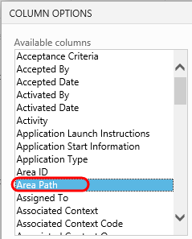

1.  Figure

1.  Add Area Path column

1.  

1.  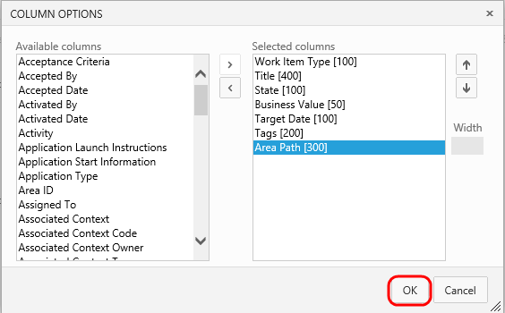

1.  Figure

1.  Add Area Path column

1.  

1.  If you look at the area path column for different product backlog
    items, you can see that they are assigned to different teams. The
    ability to drill down into the various backlogs gives the management
    team the desired level of visibility into the breakdown and
    implementation of features.

1.  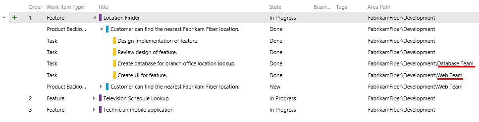

1.  Figure

1.  Area path column showing assigned teams

1.  

1.  Now let’s take a look at how to create a new feature and then link
    it to a work item that will be assigned to one of the agile teams.
    Create a new feature titled “**Reporting for technicians and
    services**” and then click the **Add** button.

1.  

1.  Figure

1.  Creating new feature

1.  

1.  Click the green ‘**+**’ button that is on the left-hand side of the
    new Feature.

1.  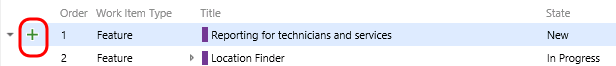

1.  Figure

1.  Adding new PBI

1.  Create a new Product Backlog Item named “**Modify databases to
    support on-demand reporting for technician activity**”. Assign it to
    the database team lead, **Adam Barr**. Set the Area to the
    **Database** team so that it shows up on their backlog. Finally,
    click **Save and Close**.

1.  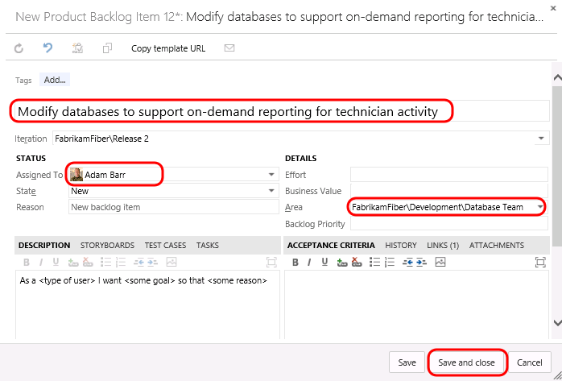

1.  Figure

1.  Adding new PBI

1.  **Note:** In the event that you create items within the backlog, you
    can also easily map them to parent Features by enabling the Mapping
    feature and then dragging and dropping.

    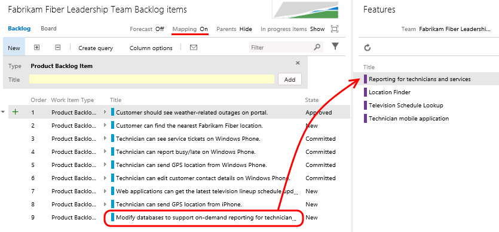

1.  Now let’s load the web portal for the database team. Navigate to the
    **Fabrikam Fiber Database Team** using the top navigation as before.

1.  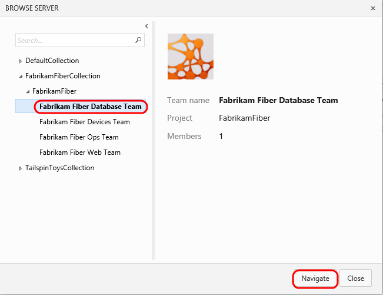

1.  Figure

1.  Navigate to database team

1.  

1.  You should now be looking at the backlog for the database team.

1.  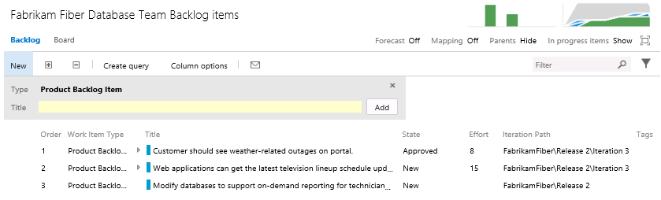

1.  Figure

1.  Backlog Items link

1.  

1.  Although this team may normally only want to view their backlog
    items, they may also want to see how those backlog items fit in to
    the bigger picture. Toggle the **Parents** option that is currently
    set to Hide.

1.  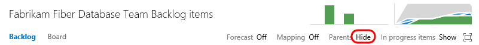

1.  Figure

1.  Toggle display of parent nodes

1.  Note that the backlog view now shows parent Feature items.

1.  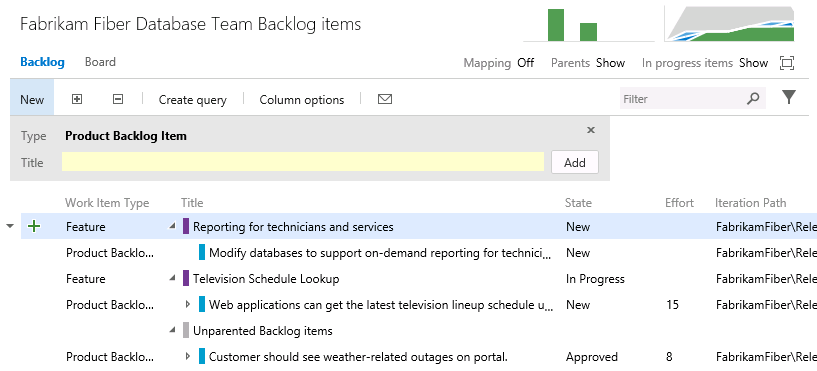

1.  Figure

1.  Backlog showing parent features

1.  

1.  To get a more complete view of their organization’s overall work,
    the database team can also view the Features backlog. Click
    **Features**.

1.  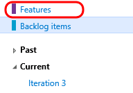

1.  Figure

1.  Features backlog

1.  

1.  Click the **Expand** button twice in order to expand the features
    backlog two levels. Note that it is easy to distinguish between work
    that the database team is contributing to or is assigned, and work
    that is assigned to other teams by looking at the colored bar. If
    the bar is hollow (not filled in), this means that the work is
    assigned to a different team.

1.  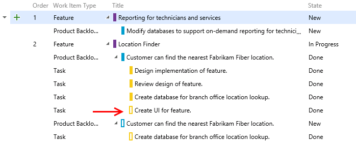

1.  Figure

1.  Viewing work assigned to team vs. other teams

1.  

1.  

Exercise 3: Flexibility of Agile Tools
------------------------------------------------------------------------------------------------------------------------------------

1.  In the previous exercise, you learned about how Team Foundation
    Server can scale to meet the needs of larger teams working towards
    common goals. This approach requires that everybody in the
    organization uses the same team project within Team Foundation
    Server and therefore the same process template (which defines the
    way work items and their workflows are defined). Understanding this,
    Microsoft has begun to allow individual teams to customize certain
    aspects of the ways in which they manage and track their work
    without requiring centralized changes to their process templates.

    In this exercise, you will learn more about Kanban and how it
    contributes to the flexibility of the agile toolset. You will also
    learn about work item tagging. Both of these features can be
    utilized and customized independently by different teams, without
    making changes to the underlying process template.

#### Task 1: Introduction to Kanban Tools

1.  The **Kanban** board was first introduced with Team Foundation
    Server 2012 Update 1. Kanban is a process improvement tool that can
    be used in an incremental fashion regardless of the current software
    development methodology that you are using. It assists with the
    throttling and tracking of work and illustrates the delivery of
    value over time to the project stakeholders. Each backlog has its
    own Kanban board, and each team has its own view of that.

2.  Navigate to the **Fabrikam Fiber Devices Team**.

1.  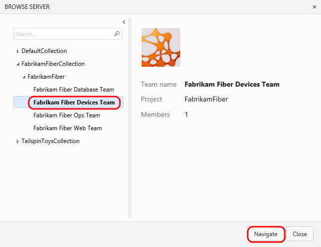

1.  Figure

1.  Navigate to devices team

1.  

1.  Navigate to the backlog Kanban board for this team.
    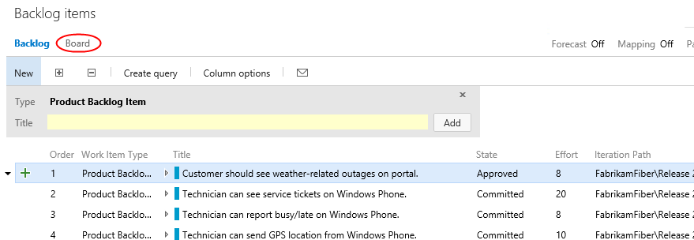

1.  Figure

1.  Kanban board link

1.  

1.  The Kanban board shows the top backlog items across all states and
    iterations allowing you to move items between states and allows you
    to set Work in Progress (WIP) limits for each state. One of the
    primary reasons for using Kanban and limiting work in progress is
    that it helps identify bottlenecks in your development process and
    minimize lead time for new features. Let’s say that the devices team
    is not delivering finished work as quickly as desired, and that it
    is suspected that the underlying issue may have to do with taking on
    too many tasks at once at the beginning of each sprint (and the
    associated context-switching tax). If we are more careful about the
    number of tasks that we commit to, perhaps we can better focus
    our efforts.

2.  Let’s lower the **Work in Progress** limit for the **Committed**
    state to see what the Kanban board looks like when too much work has
    been committed to at once. Right now, the limit is **5** work items.

1.  

1.  Figure

1.  WIP limit

1.  

1.  Click the **Configuration** button (it has a gear icon) to open the
    **Configure settings** dialog.

1.  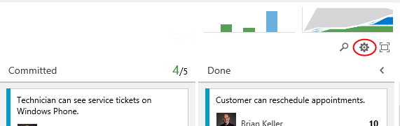

1.  Select the **Columns** tab and click the **Committed** column. Set
    the **WIP Limit** to “3” and click **Save and close**.

1.  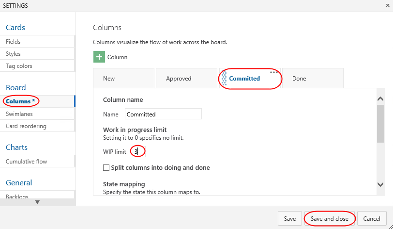

1.  Figure

1.  Setting WIP limit

1.  

1.  On the Kanban board, column headers will provide an indication when
    a Work in Progress limit is exceeded. In this case, the Committed
    column shows us that we have exceeded the limit.

1.  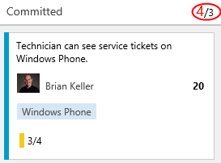

1.  Figure

1.  WIP limit exceeded

1.  

1.  **Note:** Work in Progress limits provide feedback when appropriate
    but they do not prevent a team from taking on additional work. You
    need to actively check the Kanban board in order to discover that
    you are exceeding set limits.

1.  You can also configure the Kanban boards to show (or hide) bugs
    as desired. Click the gear icon in the top-right corner of the
    window to open the administration page in a new browser tab.

    

2.  Navigate to the **Settings** tab for the **Fabrikam Fiber Devices
    Team** and scroll down to locate the **Bugs** section.

1.  

1.  Figure

1.  Team settings

1.  

1.  Change the **Bugs** option so that “**Bugs appear on the backlogs
    and boards with requirements**”.

1.  

1.  Figure

1.  Configuring bugs to show up on backlogs and board views

1.  

1.  Close the administration settings browser tab to return to the
    Kanban board view for the team and refresh the page.

2.  Click the **New Item** button and then select **Bug**.

1.  **Note:** Adding new cards and inline editing are two new features
    in Team Foundation Server 2015.

1.  

1.  Figure

1.  Adding a new bug directly on the Kanban board

1.  

1.  Add a new bug entitled **“Rendering artifacts on iPhone”** and then
    press **Enter** to save.

1.  

1.  Figure

1.  Adding new bug

1.  

1.  You can also reorder the backlog priority from the Kanban board. In
    the **Committed** column, drag the bottom card to the top of
    the column.

1.  

1.  Figure

1.  Reorder cards

1.  

1.  Filtering on the Kanban board is another new feature of Team
    Foundation Server 2015. Click the **Search** button and then search
    for “**technician**”.

1.  

1.  Figure

1.  Kanban board search filter

1.  

1.  **Clear** the search box.

1.  **Note:** The New column has an additional search filter box that
    only applies to work items in the New state, which is useful when
    you want to search for something from your backlog without losing
    context of other work items.

1.  Let’s say that the devices team has decided that they want to add in
    a column that represents work that has been tested on a
    physical device. This is the only team that would desire to keep
    track of such a state, and they can easily add this to their
    Kanban board.

2.  Click the **Configure settings** button. Here you can add, remove,
    delete, and even rename columns to better suit your team workflow.
    However, you are still subject to restrictions put in place by the
    underlying process template, so you must map columns to valid work
    item states and respect the valid state transitions.

    

3.  Navigate to the **Columns** tab and click the **+ Column** button.
    Reorder the new column to be next to **Done** and set its **Name**
    to “Device Tested”.

1.  

1.  Figure

1.  Adding a new column

1.  You can also modify what your team considers to be the meaning of
    the Definition of Done for each Kanban column. This will help teams
    to stay on the same page even when a work item should be moved to
    the next state. Scroll down to the bottom of the form and define the
    definition of “done” for this column using plain text or Markdown.
    Provide a message such as “**Has been tested on Android, Windows
    Phone, and iPhone**” and then click **Save and close**.

    

2.  You new column is now live on your board, and you can click the
    helper icon to see the **Definition of Done**.

1.  

1.  Figure

1.  Kanban board showing customizations for team

1.  

1.  Kanban support also adds a new graph to the backlog views called the
    **Cumulative Flow Diagram**. Click the small diagram to open it.

1.  

1.  Figure

1.  Cumulative Flow Diagram location

1.  

1.  The Cumulative Flow Diagram (CFD) shows the amount of work in
    various states over time for the selected team. The horizontal axis
    shows lead time and the vertical axis shows work in progress.

1.  

1.  Figure

1.  Cumulative Flow Diagram

1.  

1.  **Note:** The CFD shown above does not necessarily represent an
    ideal scenario where a team is providing continuous output. More
    typically and ideally, you would see bands of color representing all
    states increase over time like the following diagram.

    

1.  Press the **Escape** key to close the CFD.

2.  The Kanban board has a ton of great and convenient configurability
    options designed to adapt to the way your team works. Reopen to the
    **Configure settings** dialog used earlier.

    

3.  Navigate to the **Fields** tab. Here you can configure each work
    item type to show ID number, Assigned to field, Effort, Tags, or
    other fields that you wish to show. These options are configured per
    team, giving each team the flexibility it needs to manage its
    own workflow. Select the options to **Show ID** and **Show empty
    fields**.

1.  

1.  Figure

1.  Configuration options

1.  Switch to the **Bug** tab and check the same boxes here as well.
    Click **Save and close** to confirm.

    

2.  Now each work item displays its ID, which is very useful if your
    team uses these in discussions or in references from code
    or documentation.

    

3.  In addition, the empty fields are now “shown” in the card, which
    allows you to initialize them inline. Locate the item created
    earlier and assign it to **Adam Barr**.

    

4.  The concept of swim lanes is also new in 2015. These horizontal
    lanes can be added to Kanban boards to further categorize work, with
    a common use of this to create an “expedite” lane for high-priority
    work that needs to skip through the normal workflow. Reopen the
    **Configure settings** dialog used earlier.

    

5.  Kanban boards only have a single swimlane by default, you can add in
    as many lanes as you want. For example, you can use them to
    categorize items by severity (expedite, normal), departments, tiers,
    and so on. Navigate to the **Swimlanes** tab and add a new swimlane
    named “**Expedite**”.

1.  

1.  Figure

1.  Adding new swimlane

1.  

1.  Rename the default lane to “**Normal**” and then click **Save and
    close**.

1.  

1.  Figure

1.  Customizing swimlanes

1.  

1.  Expedite one of the work items using drag and drop.

1.  

1.  Figure

1.  Drag and drop cards to change swimlanes

1.  

1.  In addition to the customization of board behavior, the cards
    themselves can be easily styled. Click the **Configure settings**
    icon button to open the configuration dialog.

    

2.  Select the **Styles** tab and click **Styling rule**. Set the
    **Name** to **“High severity”**. This rule will change the style of
    the cards for bugs with high severity in order to make them easier
    to identify.

    

3.  Scroll down to change the **Card color** to a strong red and set the
    first clause to **“Severity = 1 – Critical”**. Note that you’ll need
    to manually enter the field name of **“Severity”**.

    

4.  Select the **Tag colors** tab and set a tag coloring rule to easily
    identify all cards tagged with **“Windows Phone”**. Click **Save and
    close** to continue.

    

5.  On the board, you can now see that backlog item tags for **“Windows
    Phone”** are colored yellow and are easy to identify.

    

6.  Locate the bug created earlier and click the ellipses button and
    select **Open**.

    

7.  Change the **Severity** to **1 – Critical** and click **Save and
    close**.

    

8.  Note that the bug card is now colored red to indicate its
    critical severity.

    

#### Task 2: Kanban prioritization

1.  As cards are reordered within a column on the Kanban board, their
    > relative priorities are adjusted in the backlog. Select the
    > **Backlog** tab and notice that the “Technician can see service
    > tickets…” work item is prioritized above “Technician can
    > report busy/late…”.

    

2.  Return to the **Board** tab. Locate item \#216 and drag it
    > above \#211.

    

1.  With the cards now reordered on the board, return to the **Backlog**
    tab and notice that the work items have been appropriately
    reprioritized to reflect their order on the board. Also note that
    “Customer should see weather-related outages…” has the highest
    priority in the backlog.

    

2.  Return to the **Board**. Drag—but do not drop—the “Customer should
    see weather-related outages…” card from the **Approved** column over
    the **Committed** column. Note that as you move it vertically, the
    existing cards in the column move to allow you to drop it anywhere.
    Return to drop the card over its original **Approved** column so
    that no changes are made.

    

3.  While this may be desirable to some teams, there are other teams
    that would prefer backlog item prioritization to be enforced as
    cards are moved between columns. After it, it can be difficult to
    understand where a card is currently prioritized as you graduate it
    from stage to stage. Click the **Configure settings** icon button to
    open the configuration dialog.

    

4.  Select the **Card reordering** tab and select the second option.
    This will enforce that cards are placed in the appropriate place in
    a given column based on their relative priority in the backlog. Note
    that both options have sample animations to illustrate
    each behavior. Click **Save and close**.

    

5.  Once again, drag the card from the **Approved** column over the
    **Committed** column. Note that this time, the cards in the target
    column don’t budge. Go ahead and drop it anywhere over the
    **Committed** column and note that it automatically flows to the top
    since it has the highest priority of the items in that column.

    

6.  It’s important to note that while this setting controls the behavior
    of card reordering when a card it moved between columns, you can
    still easily reorder cards within a given column. For additional
    information on using the Kanban board, please see “[Kanban
    basics](https://msdn.microsoft.com/Library/vs/alm/Work/kanban/kanban-basics)”.

7.  

#### Task 3: Work Item Tagging

1.  **Work item tagging** allows you to easily categorize, query and
    filter lists of work items.

2.  Navigate to the **Fabrikam Fiber Leadership Team**.

1.  

1.  Figure

1.  Navigating to management team

1.  

1.  Navigate to the **Backlog Items** view.

1.  

1.  Figure

1.  Backlog Items list

1.  

1.  Let’s say that a cross-team initiative is put in place to give
    customer facing work items higher priority. Also imagine that the
    product backlog is quite large, so much that visually searching
    through all titles and assigning them to sprints and teams has
    become quite time consuming. One way to help with this is to create
    work item tags and then filter the list of work items.

2.  Note that a number of work item tags are already in place.

1.  

1.  Figure

1.  Backlog showing work item tags

1.  

1.  **Double-click** the work item titled “**Customer should see
    weather-related outages on portal**”.

2.  Click **Add…** to add a tag.

1.  

1.  Figure

1.  Add button

1.  

1.  Enter the text “**Customer**” and then click **Save and Close**.

1.  

1.  Figure

1.  Adding ‘Customer’ tag

1.  

1.  Repeat the process of tagging any work items that appear to be
    customer facing. You should end up with something like the following
    screenshot, but there is no need to match it exactly.

1.  **Note:** You can create work item queries that include tags.

1.  

1.  Figure

1.  New work item tags

1.  

1.  With the desired tagging in place, click the **Filter** button in
    the top-right corner of the backlog list.

    

1.  Figure

1.  Filter button

1.  

1.  Click the **Customer** tag to filter by just that tag.

1.  

1.  Figure

1.  Filtering by work item tag

1.  

1.  With this filtered view the teams will have a much easier time
    finding the work items that they should focus on first. Note that
    this filtering also disables the ability to add new backlog items,
    disables stack ranking and forecasting.

1.  

1.  Figure

1.  Filtered backlog view

1.  

1.  **Note:** Additional filtering can be done by selecting another tag
    (if there are any in this filtered subset). To remove the filter,
    simply click the Filter button once again.

1.  

1.  

Exercise 4: Work Item Charting
----------------------------------------------------------------------------------------------------------------------------

1.  In this exercise, we will demonstrate the work item charting
    capability of Team Foundation Server. Work item charting allows you
    to create visual chart representations of the data returned from TFS
    work item queries. This can be used to help better understand the
    state of projects.

#### Task 1: Creating and Sharing Work Item Charts

1.  Navigate to the **Fabrikam Fiber Leadership Team** (if necessary).

1.  

1.  Figure

1.  Navigating to management team

1.  

1.  Let’s say that the Fabrikam Fiber management team would like to
    better understand how tasks are broken down by user. Navigate to the
    work item queries section of the web portal.

1.  

1.  Figure

1.  Work item queries view

1.  

1.  Since these charts are based on work items, we first need to define
    a query that will return the data that we are interested in. Click
    **New** and select the **New Query** option.

1.  

1.  Figure

1.  Creating a new work item query

1.  

1.  The default query will select all work items in any state for the
    current project. We want to select just Tasks, so modify the value
    of clause for **Work Item Type** to be **Task**.

1.  

1.  Figure

1.  Querying for all tasks

1.  Click the **Save Query As** button.

1.  

1.  Figure

1.  Saving new query

1.  

1.  **Note:** Work item charts require the associated query to return a
    flat list of work items.

1.  Name the query “**All Tasks”**, select the folder “**Shared
    Queries**”, and then click **OK**.

1.  

1.  Figure

1.  Naming new query

1.  

1.  Select the **Charts** tab.

1.  

1.  Figure

1.  Charts link

1.  

1.  First we will create a pie chart showing tasks by assigned user.
    Click **New Chart**.

1.  

1.  Figure

1.  New Chart button

1.  

1.  Title the chart “**Tasks by User**”, group by the **Assigned To**
    field, and then click **OK**.

1.  

1.  Figure

1.  Creating new pie chart

1.  

1.  Let’s create one more chart to help visualize the task progress for
    each team member. Click **New Chart** once again.

2.  Select the **Stacked Bar** chart type. Note that this chart type
    requires you to specify two different fields for the rows
    and columns.

1.  

1.  Figure

1.  Creating a new stacked bar chart

1.  

1.  Title the chart “**Task State by User**”, select the **Assigned To**
    field for the **Rows**, select the **State** field for the
    **Columns**, and finally click **OK** to create the chart.

1.  

1.  Figure

1.  Creating a new stacked bar chart

1.  

1.  

1.  Figure

1.  New task charts

1.  

1.  You can add to the available grouping options by modifying the work
    item query and adding in additional display columns. Select the
    **Editor** tab for the query.

1.  

1.  Figure

1.  Editor link

1.  

1.  Click **Column Options**.

1.  

1.  Figure

1.  Column Options button

1.  

1.  Select the **Task** item for the **Work Item Type**.

1.  

1.  Figure

1.  Filtering for Task fields

1.  

1.  **Double-click** the **Area Path** option from the Available
    Columns list.

1.  

1.  Figure

1.  Selecting the Area Path field

1.  

1.  Click **OK**.

1.  

1.  Figure

1.  Selecting the Area Path field

1.  

1.  Click the **Save** button.

1.  

1.  Figure

1.  Saving modified query

1.  

1.  Select the **Charts** link to return to the charts view and use your
    charting skills to create a pie chart showing tasks grouped by the
    **Area Path** field. Title the chart “**Tasks by Team**”, select the
    **Area Path** field for the **Group By** field, and finally click
    **OK** to create the chart. This gives the management team an idea
    of how the work is distributed amongst the teams.

1.  

1.  Figure

1.  Creating new pie chart

1.  

1.  These lightweight charts can also be pinned to a dashboard. Click
    the **Tasks by Team** chart’s ellipses button and select **Add to
    dashboard | Overview**. This dashboard is used on the project’s
    home page.

1.  

1.  Figure

1.  Task breakdown by team

1.  

1.  Click the **Home** link to return to the leadership team’s homepage
    and view the pinned chart.

1.  

1.  Figure

1.  Home link

1.  

1.  

1.  Figure

1.  Team homepage showing pinned chart

#### Task 2: Customizing Dashboard

1.  You can also customize a dashboard by clicking the **Edit** button
    in the bottom right corner. This will switch the dashboard into
    **edit mode**. You need to be in edit mode in order to rearrange the
    dashboard or make configuration changes, which removes the risk of
    accidental edits during normal usage.

    

2.  Utilize the **Remove** buttons to clean up the dashboard a bit. It
    doesn’t matter which items you remove.

    

3.  You can also easily add new items to the dashboard by clicking the
    **Add Widget** button. Try it now.

    

4.  Select the **Markdown** widget and click **Add**. This widget allows
    you to display any markdown file from your repository on
    the dashboard. Alternatively, you can provide the markdown manually.

    

5.  Locate the Markdown widget on your dashboard and click its
    **Edit** button.

    

6.  This will provide you with access to key settings, such as the size
    of the widget, as well as the source of the Markdown to display.
    Press **Esc** to cancel.

    

7.  Click the **Manage Dashboards** button in the top right corner of
    the view.

    

8.  This dialog provides access to functionality for managing your
    dashboard, including its creation. Note that each dashboard has an
    option to **Auto-refresh dashboard**, which is great for scenarios
    where you want to display information in public team areas, such as
    on large TVs.

    

9.  When satisfied, click the **Close Edit Mode** button to apply
    all changes.

    

10. You can also create additional tabs for your dashboard in orders to
    offer different views into the project. Click the **Add a new
    Dashboard** button to create a new dashboard.

    

11. Enter **“Quality”** as the name and press **Enter**.

    

12. You now have multiple dashboard tabs and can edit and customize each
    using the same process from earlier.

    

1.  **Note**: After completing this lab, the virtual machine will
    continue to run with the date & time that was set for demonstration
    purposes at the beginning of this lab. Don’t forget to reset the
    virtual machine to its original snapshot/checkpoint after you
    complete this lab.

1.  1.  2.  

    

    1.  

